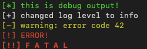

# pwnlog

Dead-simple, leveled-logging in Golang, pwn style. Colors and message prefixes are as the universe intended them to be:

```
   debug    -> <span style="color:green">[*] debugging text</span>
   info     -> [+] info text
   warning  -> [-] warning text
   error    -> [!] error text
   fatal    -> [!!] fatal error text (followed by death of program)
```

Example usage:
```golang
    logger := pwnlog.New(pwnlog.DebugLevel)
    logger.Debug("this is debug output!")

    logger.SetLevel(pwnlog.InfoLevel)
    logger.Debug("you should NOT see this debug output")
    logger.Info("changed log level to %s", "info")
    logger.Warning("warning: error code %d", 42)
    logger.Error("ERROR!")

    // goodbye program
    logger.Fatal("F A T A L")
```

which produces the following:




